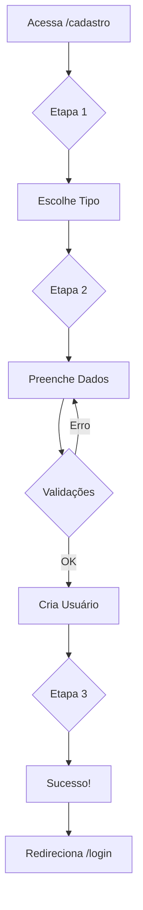

# 📝 Cadastro por Tipo de Perfil - DF Treinamentos

## 🎯 Objetivo

Permitir que novos usuários se cadastrem escolhendo o tipo de perfil (Aluno, Palestrante ou Administrador), facilitando o início do uso da plataforma.

---

## ✨ Funcionalidades

### **Etapa 1: Seleção de Tipo**

Interface visual com 3 cards interativos:

```
┌─────────────┐  ┌─────────────┐  ┌─────────────┐
│ 🎓 Aluno    │  │ 👥 Palestr. │  │ ⚙️  Admin   │
│             │  │             │  │             │
│ • Acessar   │  │ • Apresentar│  │ • Criar     │
│ • Certificar│  │ • Acompanhar│  │ • Gerenciar │
│ • Progredir │  │ • Modo Apres│  │ • Relatórios│
│             │  │             │  │             │
│ [Criar >]   │  │ [Criar >]   │  │ [Criar >]   │
└─────────────┘  └─────────────┘  └─────────────┘
```

### **Etapa 2: Dados Pessoais**

Formulário adaptado ao tipo selecionado:

**Campos comuns (todos):**
- Nome completo *
- E-mail *
- Senha * (min. 6 caracteres)
- Confirmar senha *

**Campos extras (Palestrante/Admin):**
- Empresa/Organização
- Cargo

### **Etapa 3: Sucesso**

Confirmação visual + redirecionamento automático para login.

---

## 🎨 Design

### **Cores por Tipo:**

| Tipo | Cor Principal | Icon |
|------|--------------|------|
| **Aluno** | Azul (`#014175`) | 🎓 GraduationCap |
| **Palestrante** | Laranja (`#FF6B00`) | 👥 Users |
| **Admin** | Roxo (`#9333ea`) | ⚙️  UserCog |

### **Interatividade:**

- ✅ **Hover effects:** Cards aumentam e mudam borda
- ✅ **Ícones animados:** Scale 110% no hover
- ✅ **Badges:** Tipo selecionado exibido na etapa 2
- ✅ **Voltar:** Pode voltar para trocar de tipo

---

## 🔒 Permissões por Tipo

### **👨‍🎓 Aluno**
- ✅ Acessar todos os treinamentos
- ✅ Fazer testes e obter notas
- ✅ Ver progresso e resultados
- ✅ Baixar certificados
- ✅ Visualizar apostilas
- ❌ Criar conteúdo
- ❌ Gerenciar usuários

### **👨‍🏫 Palestrante**
- ✅ Tudo que o Aluno pode
- ✅ Apresentar treinamentos (modo apresentação)
- ✅ Acompanhar progresso dos alunos
- ✅ Ver relatórios básicos
- ❌ Criar/editar treinamentos
- ❌ Gerenciar usuários

### **⚙️  Administrador**
- ✅ **TUDO** que Aluno e Palestrante podem
- ✅ Criar e editar treinamentos
- ✅ Gerenciar módulos e slides
- ✅ Criar testes e questões
- ✅ Gerenciar usuários
- ✅ Gerar apostilas
- ✅ Relatórios completos

---

## 🔄 Fluxo Completo



---

## 🧪 Como Testar

### **1. Acesse a página de cadastro:**
```
http://localhost:3000/cadastro
```

### **2. Teste cada tipo:**

**Como Aluno:**
1. Clique no card "Aluno"
2. Preencha: Nome, Email, Senha
3. Clique "Criar Conta"
4. Veja sucesso + redirecionamento

**Como Palestrante:**
1. Clique no card "Palestrante"
2. Preencha: Nome, Email, **Empresa**, **Cargo**, Senha
3. Crie e teste login

**Como Admin:**
1. Clique no card "Administrador"
2. Preencha todos os campos
3. Após login, veja menu completo de admin

### **3. Validações:**

Teste erros:
- ❌ Senha < 6 caracteres
- ❌ Senhas não coincidem
- ❌ Email inválido
- ❌ Email já cadastrado
- ❌ Campos vazios

---

## 💾 Dados Salvos

Ao criar conta, é salvo em `auth.users` e `profiles`:

```sql
-- profiles
{
  id: uuid (do auth.users),
  nome: "João Silva",
  email: "joao@example.com",
  role: "aluno" | "palestrante" | "admin",
  empresa: "DF Corretora" (opcional),
  cargo: "Gerente" (opcional),
  avatar_url: null,
  created_at: timestamp
}
```

---

## 🚀 Benefícios

### **Para o Negócio:**
- ✅ **Onboarding rápido:** Usuários começam imediatamente
- ✅ **Segmentação clara:** Cada tipo sabe o que pode fazer
- ✅ **Expansão facilitada:** Fácil adicionar palestrantes
- ✅ **Controle:** Admins separados de usuários comuns

### **Para os Usuários:**
- ✅ **Clareza:** Sabem exatamente o que vão acessar
- ✅ **Visual atraente:** Cards bonitos e informativos
- ✅ **Rápido:** 2 etapas simples
- ✅ **Seguro:** Validações e feedback claro

---

## 🔄 Próximos Passos

### **Melhorias Opcionais:**

1. **Aprovação de Admins:**
   - Novos admins ficam pendentes
   - Admin existente aprova

2. **Código de Convite:**
   - Admin/Palestrante requer código
   - Gerado pelo sistema

3. **Verificação de Email:**
   - Email de confirmação obrigatório
   - Link de ativação

4. **Domínio Corporativo:**
   - Validar email @dfcorretora.com.br
   - Auto-aprovar se for domínio oficial

5. **Perfil Social:**
   - Login com Google
   - Login com Microsoft

---

## 📁 Arquivos

**Criado:**
- `src/app/cadastro/page.tsx` (completo, 3 etapas)

**Usa:**
- `src/lib/supabase/client.ts`
- `src/components/ui/Toast.tsx`
- `src/components/ui/Input.tsx`
- `src/components/ui/Card.tsx`
- `src/components/ui/Button.tsx`

---

## ✅ Status

**PRONTO PARA USO!** 🚀

O cadastro por tipo está completo e funcional. Agora você pode:
1. Criar usuários de qualquer tipo
2. Começar a popular a plataforma
3. Testar permissões por role

**Teste agora em:** `http://localhost:3000/cadastro`

